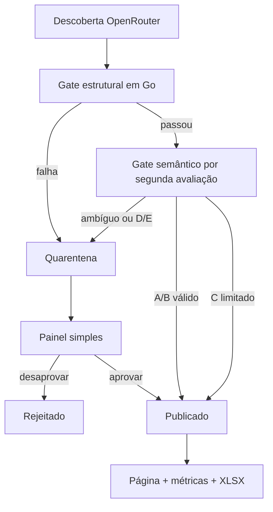

# VorcaroZAP

Aplicação pública, investigativa e documental para organizar informações publicadas sobre Daniel Vorcaro, Banco Master e pessoas, organizações e acontecimentos relacionados. A plataforma combina monitoramento automatizado, fontes rastreáveis, classificação editorial, métricas públicas e pós-moderação humana.

> Projeto independente, sem vínculo com WhatsApp, Meta, Banco Master ou pessoas e instituições citadas. “WhatsApp” é marca de seu titular. A identidade usa referência cromática, sem reproduzir logotipo ou interface oficial.

## Estado

- **Fase 1 — Fundação Executável concluída.** Módulo Go, CLI, configuração com defaults seguros, SQLite em modo WAL com validação efetiva de pragmas e driver Pure Go `modernc.org/sqlite` ([ADR-010](docs/adr/ADR-010-escolha-do-driver-sqlite.md)), migrations com Goose, servidor HTTP Chi, renderização SSR com Templ, página base mobile-first, Dockerfile enxuto não-root e Compose com proxy Caddy opcional. Toolchain de desenvolvimento 100% via Docker e Makefile.
- **Fase 2 — Núcleo editorial e importação:**
  - **VZ-004 — Núcleo editorial e schema relacional concluído.** Pacote `internal/domain` com enums e tipos puros sem dependências de infraestrutura; migration `00002_editorial_core.sql` com tabelas `entities`, `entity_aliases`, `cases`, `relationships`, `import_runs`, `claims`, `evidence`, `sources` e `evidence_sources`; integridade relacional estrita (XOR, autorrelação, foreign keys com `ON DELETE` explícito); suporte a queries e transações seguras via SQLC (`internal/store/sqlc`).
  - **VZ-005 — Importador XLSX `curated_seed` concluído.** Pacote `internal/importer` com leitor Excelize, validação estrita de mapping versionado (`config/import-mapping-v1.yaml`), normalização conservadora de URLs e Unicode, idempotência comprovada no SQLite (`uq_import_runs_applied`), suporte a `--dry-run` e execução transacional segura sem dados inventados.
- **Fase 3 — Página pública e métricas:**
  - **VZ-006 — Listagem pública, busca, filtros e detalhe de entidades e alegações concluído.** Listagem paginada em `/pessoas` com ordenação segura por allowlist (`name`, `relevance`, `updated`), filtros multifacetados por Grau (A–E), categoria e nível de relevância (1 a 5), busca textual (`name`, `role_or_context`, `summary`, `relevance_rationale`), preservação de query parameters na navegação paginada e detalhe em `/pessoas/{slug}` com segregação visual de fontes (`supports`, `contradicts`, `contextualizes`), seção de manifestação e defesa, omissão limpa de trechos vazios, e garantia de invisibilidade de entidades e alegações em quarentena ou sem suporte ativo.
  - **VZ-007 — Metodologia pública, fontes rastreáveis e linguagem humana A–E concluído.** Página informativa em `/metodologia` com fundamentação da independência editorial, ausência de juízo de culpa, definições humanas completas para Graus A a E, níveis de relevância institucional 1 a 5, disposições editoriais, regras estritas de elegibilidade métrica da rede (`metric_eligible = true`), transparência sobre acessibilidade de fontes (`not_checked`, `reachable`, `unreachable`), distinção entre resumo editorial e citação literal, e política ágil de contraditório e retificações. Interface 100% navegável via Server-Side Rendering sem dependência de JavaScript, acessível (WCAG AA) e responsiva mobile-first.
  - **VZ-008 — Engine de métricas públicas por estado ativo e integração na Home concluído.** Visão canônica da fronteira pública (`public_claims_view`, [ADR-011](docs/adr/ADR-011-fronteira-publica-canonica-e-metricas-por-estado-ativo.md)); motor de métricas em `internal/metrics` calculando totais do acervo público e da rede elegível (`metric_eligible = true`), distribuições documentais por Grau (A–E), relevância (1–5) e categorias sem duplicatas por joins; data de corte configurável (`PUBLIC_DATA_CUTOFF=2026-09-03`); página inicial em `/` totalmente integrada com Server-Side Rendering, barras visuais de proporção em CSS puro, links diretos para filtros de pessoas e aviso neutro informando que o monitoramento autônomo contínuo ainda não foi ativado.
  - **VZ-009 — Exportação XLSX derivada do banco e download público concluído.** Pacote `internal/exporter` com subcomando CLI `export` e rota HTTP `/exportar/base.xlsx`, derivando da fronteira pública e preservando contexto/correções públicos mesmo com `metric_eligible = false` (a elegibilidade métrica restringe apenas métricas de rede).
- **Fase 4 — Monitoramento OpenRouter:**
  - **VZ-020 — Verificador GET seguro e limitado de fontes externas concluído.** Pacote `internal/sourcecheck` com proteção contra SSRF e DNS rebinding, conexão a IP validado, limites de bytes/tempo/redirecionamentos e política de acessibilidade conforme [ADR-006](docs/adr/ADR-006-fontes-e-rastreabilidade.md).
  - **VZ-010 — `ResearchProvider`/OpenRouter e descoberta via `openrouter:web_search` concluído.** Pacote `internal/research` com fronteira abstrata e adaptador concreto `internal/research/openrouter` usando biblioteca padrão `net/http`, suporte à server tool `openrouter:web_search` atual, limites conservadores de buscas/custos, instruções defensivas no prompt contra prompt injection (a política Go e gates futuros permanecem obrigatórios) e extração de citações técnicas e consumo de tokens.
  - **VZ-011 — Schema estruturado de candidatos, normalização e deduplicação concluído.** Migration `00006_monitoring_runs_and_candidates.sql`, Structured Outputs via JSON Schema estrito no OpenRouter, pacote puro de normalização `internal/normalize`, fingerprint SHA-256 versionado v1, serviço de ingestão e deduplicação auditável `internal/monitoring` e isolamento estrito contra a fronteira pública (`public_claims_view`), conforme [ADR-013](docs/adr/ADR-013-monitoring-runs-and-candidates-deduplication.md).
  - **VZ-012 — Gate estrutural Go, gate semântico LLM e política automática A/B/C versus D/E concluído.** Migration `00007_monitoring_gates_and_verification.sql`, gate estrutural puro em Go (`internal/domain`), verificação semântica via OpenRouter com JSON Schema estrito (`Verify`), política Go determinística por Grau A–E, histórico imutável em `semantic_evaluations`, materialização editorial transacional curta em SQLite e integração à fronteira pública e métricas, conforme [ADR-014](docs/adr/ADR-014-gate-estrutural-gate-semantico-e-politica-de-publicacao-automatica.md).
  - **VZ-013 — Lock de execução, janela incremental e limites de custo de LLM concluído.** Migration `00008_monitoring_lock_and_budget.sql`, lock distribuído com lease SQLite (`monitoring_locks`) e renovação em background com cancelamento reativo, avanço determinístico de janela incremental UTC (`window_start` / `window_end`) ancorado na última run `completed`, gestão orçamentária estrita baseada no custo real retornado pelo OpenRouter (`usage.cost`) em micro-USD com pré-checagem diária e parada graciosa em `partial`, e comando CLI `vorcarozap monitor --query "..."`, conforme [ADR-015](docs/adr/ADR-015-lock-de-execucao-janela-incremental-e-limites-de-custo-llm.md).
- **Fase 5 — Painel simples e moderação humana:**
  - **VZ-014 — Proteção simples do `/admin` por autenticação HTTP concluído.** Autenticação HTTP Basic Auth implementada diretamente no monólito Go (`ADMIN_USER` e `ADMIN_PASSWORD_HASH`), validação rigorosa de hash bcrypt restrito à faixa de custo 12 a 14 com bloqueio de senhas em texto puro, proteção integral de toda a árvore `/admin` antes de 404/405, mitigação de timing attacks via constante temporal e execução incondicional de verificação bcrypt, cabeçalhos restritivos de cache (`Cache-Control: no-store`, `Vary: Authorization`), comportamento fail-closed (quando desabilitado responde `404 Not Found` sem desafio `WWW-Authenticate`) e página SSR mínima de confirmação, conforme [ADR-016](docs/adr/ADR-016-protecao-simples-do-admin-por-basic-auth-e-bcrypt.md).
  - **VZ-015 — Painel simples para listagem e inspeção de fontes, evidências e candidatos concluído.** Interface administrativa Server-Side Rendering (SSR via Templ) protegida por Basic Auth para leitura e inspeção profunda: dashboard com contagens operacionais consolidadas (`/admin`), listagem paginada de candidatos de monitoramento (`/admin/candidatos`), inspeção detalhada de candidato com histórico de `semantic_evaluations` sem vazamento de `raw_response` (`/admin/candidatos/{id}`), listagem paginada de usos de evidência com aviso editorial explícito de moderação no `evidence_source` (`/admin/evidencias`) e listagem paginada de fontes documentais com acessibilidade e links seguros com `target="_blank"` e `rel="noopener noreferrer"` (`/admin/fontes`).
- **Próximo item:** VZ-016 — Ações de moderação: desaprovar, restaurar e aprovar quarentena.

O arquivo `_notes/mapa-vorcaro-contatos-2026-09-03.xlsx` é um artefato público de pesquisa e base inicial. Estar no arquivo não equivale a culpa nem dispensa classificação e fonte na aplicação.

A carga inicial usa `origin = curated_seed` e o mapeamento editorial versionado em `config/import-mapping-v1.yaml`. O mapeamento define grau, estado inicial, disposição e elegibilidade métrica; correções/contexto podem ser públicos sem contar como vínculo. Linhas que não satisfazem os requisitos da carga curada entram em quarentena.

## MVP

- Go, SSR com `templ`/HTMX, SQLite e Caddy;
- importação da planilha inicial;
- monitoramento via OpenRouter/web search;
- gate estrutural em Go e gate semântico por segunda avaliação da LLM;
- política Go publicando automaticamente A/B válidos e C com linguagem/limites explícitos;
- quarentena por padrão para D/E e para qualquer conteúdo ambíguo/incompleto;
- painel simples protegido para fontes, evidências e moderação;
- listagem, busca, filtros, detalhes e fontes;
- métricas públicas de rede derivadas apenas de claims ativos e elegíveis;
- download da planilha/base;
- deploy em Oracle VPS.

Não integram o MVP: RBAC multiusuário, MFA, workflow de dupla revisão, snapshots completos, observabilidade sofisticada, alta disponibilidade e cobertura ampla de testes.

## Fluxo



## Ambiente e Toolchain

Docker e Docker Compose são os únicos requisitos no host. Não é necessário instalar Go, Templ ou outras ferramentas no ambiente local/WSL. O toolchain completo, compiladores e versões de dependências ficam fixados e isolados pelo projeto via Docker Compose e Makefile.

### Configuração de portas

O projeto separa explicitamente a porta da aplicação da porta do host:
- `APP_PORT=8080`: porta interna em que a aplicação escuta no container;
- `HOST_PORT=8090`: porta mapeada no host pelo Docker Compose (`8090:8080`).

No proxy Caddy local, o cabeçalho `Strict-Transport-Security` (HSTS) fica desativado por atender apenas `:80` HTTP, devendo retornar na configuração de produção com HTTPS real.

## Comandos de desenvolvimento (Makefile)

Todos os comandos de desenvolvimento executam dentro do container `dev`:

```bash
# Gerar templates Templ
make templ

# Formatar código Go
make fmt

# Sincronizar dependências Go
make tidy

# Executar testes unitários
make test

# Executar testes com race detector
make test-race

# Análise estática com go vet
make vet

# Compilar aplicação
make build

# Validação completa do ciclo
make all
```

## Comandos operacionais (Compose)

```bash
# Iniciar a aplicação (compila e sobe container 'app' na porta 8090)
make run

# Executar migrations pendentes explicitamente no container
make migrate

# Simulação de importação (dry-run, sem persistência)
make import-dry-run

# Importação aplicada da planilha curated_seed (transacional e idempotente)
make import

# Subir com proxy Caddy reverso opcional (porta 8000)
make compose-proxy

# Executar monitoramento automatizado de novas publicações (OpenRouter + Gates + Orçamento)
vorcarozap monitor --query "<consulta de pesquisa>"

# Exportar base pública ativa em planilha XLSX
vorcarozap export [--out <caminho.xlsx>]

# Download HTTP público da planilha
GET /exportar/base.xlsx (ou /exportar)
```

## Validação econômica

Sem meta de cobertura no MVP. Gate inicial:

```bash
make all
```

Migrations, importação, monitoramento, moderação e jornadas públicas passam por smoke test manual. Três grupos têm testes unitários table-driven desde o MVP: decisão `published`/`quarantined`, fingerprint rejeitado impedindo republicação e métricas excluindo estados não públicos ou claims não elegíveis.

## Documentação

- [Visão](docs/00-visao-do-produto.md)
- [Requisitos funcionais](docs/01-requisitos-funcionais.md)
- [Requisitos não funcionais](docs/02-requisitos-nao-funcionais.md)
- [Modelo editorial](docs/03-modelo-editorial-e-evidencias.md)
- [Arquitetura](docs/04-arquitetura.md)
- [Modelo de dados](docs/05-modelo-de-dados.md)
- [Segurança e privacidade](docs/06-seguranca-e-privacidade.md)
- [Monitoramento e LLM](docs/07-monitoramento-e-llm.md)
- [Roadmap](docs/08-roadmap.md)
- [Backlog](docs/09-backlog-inicial.md)
- [Critérios de aceite](docs/10-criterios-de-aceite.md)
- [ADRs](docs/adr/)
