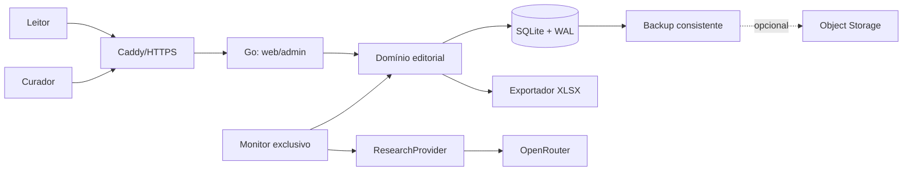

# VorcaroZAP

Base pública, investigativa e documental para organizar informações publicadas sobre Daniel Vorcaro, Banco Master e entidades, relações e acontecimentos associados ao caso. O produto separa fatos, alegações atribuídas, evidências, contraditórios e pistas; presença na base não significa culpa ou irregularidade.

> Projeto independente, sem vínculo, autorização ou parceria com WhatsApp, Meta, Banco Master ou qualquer pessoa ou instituição citada. “WhatsApp” é marca de seu titular. O projeto não usa seu logotipo nem reproduz sua interface.

## Estado

**Fase 0 — fundação documental.** Não há aplicação implementada. O único insumo existente na auditoria de 03/09/2026 foi `_notes/mapa-vorcaro-contatos-2026-09-03.xlsx`, tratado como referência editorial não publicada. A próxima etapa recomendada é a fundação técnica, depois da validação das decisões pendentes.

## Arquitetura resumida

Monólito modular em Go, uma instância, páginas server-side com `templ` e HTMX, SQLite em volume local, Caddy/HTTPS e tarefas operacionais no mesmo binário. Regras editoriais ficam no domínio; HTTP, SQLite, XLSX e OpenRouter são adaptadores. A IA somente produz candidatos sujeitos a revisão humana.



## Estrutura planejada

```text
cmd/vorcarozap/          entrada e comandos serve/migrate/seed/monitor/export/backup
internal/                config, domain, store, editorial, research, monitoring,
                         export, web, auth e observability
migrations/ e queries/   esquema versionado e SQL para sqlc
web/                     componentes templ, páginas e arquivos estáticos
docs/                    especificação, ADRs, roadmap e backlog
scripts/ e tests/        operação e testes auxiliares
```

## Pré-requisitos e execução futura

Após a Fase 1: Go estável selecionado e fixado no `go.mod`, Docker com Compose v2, Caddy e ferramentas geradas nas versões fixadas pelo projeto. Os comandos pretendidos são:

```bash
vorcarozap serve
vorcarozap migrate
vorcarozap seed
vorcarozap monitor
vorcarozap export
vorcarozap backup
```

O `Makefile` deverá oferecer configuração local, geração (`templ`/`sqlc`), teste, migrations e Compose. Até esses arquivos existirem, os comandos acima são contrato planejado, não instruções executáveis. Importação será um subcomando explícito com `--dry-run`; monitoramento nunca publicará automaticamente.

## Configuração planejada

```env
APP_ENV=development
HTTP_ADDR=:8080
DATABASE_PATH=/data/vorcarozap.db
SESSION_SECRET=
PUBLIC_BASE_URL=http://localhost:8080
OPENROUTER_API_KEY=
OPENROUTER_BASE_URL=https://openrouter.ai/api/v1
OPENROUTER_MODEL_DISCOVERY=
OPENROUTER_MODEL_VERIFICATION=
OPENROUTER_MODEL_SUMMARY=
OPENROUTER_SEARCH_ENGINE=auto
```

Segredos nunca serão commitados. `.env.example` terá apenas valores seguros. Modelos serão configuração, validados por capacidade no início da execução.

## Operação planejada

- Docker: `docker compose up --build`; um volume local persistirá `/data`.
- Testes: `go test ./...`; Playwright somente nas jornadas críticas justificadas.
- Migrations: `vorcarozap migrate`; avanço versionado e backup antes de mudança destrutiva.
- Importação: validar XLSX, executar dry-run e relatório; registros entram como `pending_review`.
- Monitoramento: execução exclusiva, reiniciável e auditável; exige aprovação humana.
- Exportação: XLSX derivado do banco, com versão/hash e publicação atômica.
- Backup: API de backup online do SQLite como padrão; integridade e restauração testadas.

## Princípios editoriais

- Relação não é culpa; contato não prova conversa, benefício ou ilícito.
- Alegações pertencem a registros próprios, não à identidade da pessoa.
- Evidência (A–E), confiança técnica e relevância pública (1–5) são dimensões independentes.
- Cada afirmação pública deve indicar o que a fonte sustenta e apresentar contraditório aplicável.
- IA não publica, ausência de resposta não equivale a admissão e rejeições permanecem auditáveis.
- Correções preservam histórico; dados pessoais são minimizados e redigidos quando necessário.

## Documentação

- [Visão do produto](docs/00-visao-do-produto.md)
- [Requisitos funcionais](docs/01-requisitos-funcionais.md)
- [Requisitos não funcionais](docs/02-requisitos-nao-funcionais.md)
- [Modelo editorial e evidências](docs/03-modelo-editorial-e-evidencias.md)
- [Arquitetura](docs/04-arquitetura.md)
- [Modelo de dados](docs/05-modelo-de-dados.md)
- [Segurança e privacidade](docs/06-seguranca-e-privacidade.md)
- [Monitoramento e LLM](docs/07-monitoramento-e-llm.md)
- [Roadmap](docs/08-roadmap.md)
- [Backlog inicial](docs/09-backlog-inicial.md)
- [Critérios de aceite](docs/10-criterios-de-aceite.md)
- [Decisões arquiteturais](docs/adr/)

