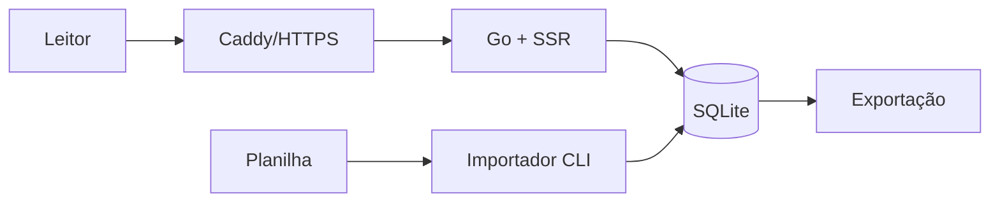

# VorcaroZAP

Aplicação pública e documental para organizar informações publicadas sobre Daniel Vorcaro, Banco Master e pessoas, organizações e acontecimentos relacionados. O produto separa relação, alegação, fonte, relevância e força da evidência; presença na base não significa culpa ou irregularidade.

> Projeto independente, sem vínculo com WhatsApp, Meta, Banco Master ou pessoas e instituições citadas. “WhatsApp” é marca de seu titular. A identidade visual usa apenas referência cromática e não reproduz marca ou interface oficial.

## Estado

**Fase 0 concluída — escopo do MVP rápido definido.** A próxima etapa é construir a primeira versão pública de leitura. O arquivo `_notes/mapa-vorcaro-contatos-2026-09-03.xlsx` é um artefato público de pesquisa com fontes, mas não equivale a conteúdo editorial automaticamente aprovado.

## Primeira versão

O primeiro lançamento terá:

- aplicação Go server-side, mobile first;
- SQLite em volume local;
- importação da planilha por CLI;
- listagem alfabética, busca e filtros essenciais;
- páginas de detalhes com fontes e classificação;
- resumo e metodologia;
- download da base;
- deploy em uma Oracle VPS com Docker e Caddy.

Ficam para as próximas versões: painel administrativo, usuários/RBAC/MFA, monitoramento por OpenRouter, ingestão automática, snapshots, auditoria avançada, observabilidade, backup externo sofisticado e suíte automatizada de testes.

## Arquitetura inicial



O desenho continua sendo um monólito modular. Capacidades futuras terão fronteiras previstas, mas não serão implementadas antes de serem necessárias.

## Comandos previstos no primeiro corte

```bash
vorcarozap serve
vorcarozap migrate
vorcarozap import --file ./arquivo.xlsx --dry-run
vorcarozap import --file ./arquivo.xlsx
vorcarozap export
```

## Validação inicial

Não haverá meta de cobertura nem suíte E2E no primeiro lançamento. O gate inicial é econômico:

```bash
go fmt ./...
go vet ./...
go build ./...
```

Além disso, migrations, importação e jornadas públicas passam por smoke test manual documentado. Testes automatizados serão introduzidos quando bugs recorrentes, colaboração, painel, monitoramento ou crescimento justificarem o custo.

## Princípios editoriais

- Relação não é culpa e contato não prova ilícito.
- Toda associação exibida possui fonte e linguagem compatível com seu grau.
- Evidência A–E e relevância 1–5 são dimensões independentes.
- Fontes e datas ficam visíveis ao leitor.
- Pistas e alegações são identificadas como tais.
- Atualizações iniciais são revisadas manualmente antes da importação/publicação.

## Documentação

- [Visão](docs/00-visao-do-produto.md)
- [Requisitos funcionais](docs/01-requisitos-funcionais.md)
- [Requisitos não funcionais](docs/02-requisitos-nao-funcionais.md)
- [Modelo editorial](docs/03-modelo-editorial-e-evidencias.md)
- [Arquitetura](docs/04-arquitetura.md)
- [Modelo de dados](docs/05-modelo-de-dados.md)
- [Segurança e privacidade](docs/06-seguranca-e-privacidade.md)
- [Monitoramento e LLM](docs/07-monitoramento-e-llm.md)
- [Roadmap](docs/08-roadmap.md)
- [Backlog](docs/09-backlog-inicial.md)
- [Critérios de aceite](docs/10-criterios-de-aceite.md)
- [ADRs](docs/adr/)

