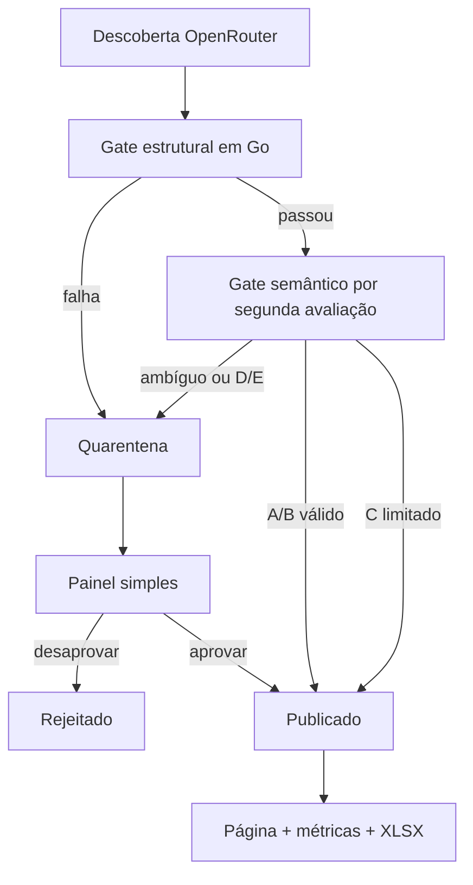

# VorcaroZAP

Aplicação pública, investigativa e documental para organizar informações publicadas sobre Daniel Vorcaro, Banco Master e pessoas, organizações e acontecimentos relacionados. A plataforma combina monitoramento automatizado, fontes rastreáveis, classificação editorial, métricas públicas e pós-moderação humana.

> Projeto independente, sem vínculo com WhatsApp, Meta, Banco Master ou pessoas e instituições citadas. “WhatsApp” é marca de seu titular. A identidade usa referência cromática, sem reproduzir logotipo ou interface oficial.

## Estado

**Fase 0 — especificação consolidada.** O MVP prioriza o motor público: coleta via OpenRouter, normalização, validação, publicação automática controlada, métricas, consulta pública e painel simples para pós-moderação.

O arquivo `_notes/mapa-vorcaro-contatos-2026-09-03.xlsx` é um artefato público de pesquisa e base inicial. Estar no arquivo não equivale a culpa nem dispensa classificação e fonte na aplicação.

A carga inicial usa `origin = curated_seed` e o mapeamento editorial versionado em `config/import-mapping-v1.yaml`. O mapeamento define grau, estado inicial, disposição e elegibilidade métrica; correções/contexto podem ser públicos sem contar como vínculo. Linhas que não satisfazem os requisitos da carga curada entram em quarentena.

## MVP

- Go, SSR com `templ`/HTMX, SQLite e Caddy;
- importação da planilha inicial;
- monitoramento via OpenRouter/web search;
- gate estrutural em Go e gate semântico por segunda avaliação da LLM;
- política Go publicando automaticamente A/B válidos e C com linguagem/limites explícitos;
- quarentena por padrão para D/E e para qualquer conteúdo ambíguo/incompleto;
- painel simples protegido para fontes, evidências e moderação;
- listagem, busca, filtros, detalhes e fontes;
- métricas públicas de rede derivadas apenas de claims ativos e elegíveis;
- download da planilha/base;
- deploy em Oracle VPS.

Não integram o MVP: RBAC multiusuário, MFA, workflow de dupla revisão, snapshots completos, observabilidade sofisticada, alta disponibilidade e cobertura ampla de testes.

## Fluxo



## Comandos planejados

```bash
vorcarozap serve
vorcarozap migrate
vorcarozap import --file arquivo.xlsx --dry-run
vorcarozap import --file arquivo.xlsx
vorcarozap monitor
vorcarozap export
```

## Validação econômica

Sem meta de cobertura no MVP. Gate inicial:

```bash
go fmt ./...
go vet ./...
go build ./...
```

Migrations, importação, monitoramento, moderação e jornadas públicas passam por smoke test manual. Três grupos têm testes unitários table-driven desde o MVP: decisão `published`/`quarantined`, fingerprint rejeitado impedindo republicação e métricas excluindo estados não públicos ou claims não elegíveis.

## Documentação

- [Visão](docs/00-visao-do-produto.md)
- [Requisitos funcionais](docs/01-requisitos-funcionais.md)
- [Requisitos não funcionais](docs/02-requisitos-nao-funcionais.md)
- [Modelo editorial](docs/03-modelo-editorial-e-evidencias.md)
- [Arquitetura](docs/04-arquitetura.md)
- [Modelo de dados](docs/05-modelo-de-dados.md)
- [Segurança e privacidade](docs/06-seguranca-e-privacidade.md)
- [Monitoramento e LLM](docs/07-monitoramento-e-llm.md)
- [Roadmap](docs/08-roadmap.md)
- [Backlog](docs/09-backlog-inicial.md)
- [Critérios de aceite](docs/10-criterios-de-aceite.md)
- [ADRs](docs/adr/)
