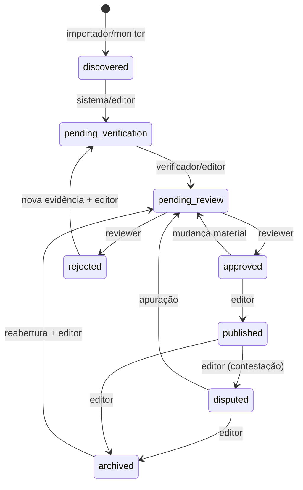

# Requisitos funcionais

`P0` integra o MVP; `P1` é importante; `P2` é evolução. Cada requisito deverá ter teste ou evidência de aceite.

## Consulta pública

- **RF-PUB-01 (P0):** exibir aviso de independência, resumo editorial versionado, totais, data de corte e última revisão.
- **RF-PUB-02 (P0):** listar pessoas alfabeticamente em cartões com função, síntese neutra, grau, relevância, estado e atualização.
- **RF-PUB-03 (P0):** buscar por nome/apelido, cargo, organização, relação e resumo de evidência, com normalização de caixa e acentos.
- **RF-PUB-04 (P0):** filtrar por categoria, evidência, relevância, estado publicável, contraditório e intervalo de atualização; combinar filtros por AND e aceitar múltiplos valores da mesma dimensão.
- **RF-PUB-05 (P0):** ordenar por nome, relevância, evidência e atualização, com desempate determinístico por nome e ID.
- **RF-PUB-06 (P0):** detalhar entidade, relações, alegações, evidências, fontes, contraditórios, data e histórico público, sem expor rascunhos.
- **RF-PUB-07 (P0):** cada alegação deve indicar classificação, linguagem de atribuição e fonte(s) com título, autor/veículo, publicação, acesso e disponibilidade.
- **RF-PUB-08 (P0):** publicar legenda editorial e metodologia; não depender só de cor.
- **RF-PUB-09 (P1):** mostrar linha do tempo de alterações materiais e página de correções.
- **RF-PUB-10 (P0):** servir XLSX atual e metadados de versão/hash.

## Curadoria e administração

- **RF-ADM-01 (P0):** autenticar usuários, encerrar sessões, aplicar papéis `reviewer`, `editor` e `admin` e registrar ações sensíveis.
- **RF-ADM-02 (P0):** criar/editar pessoas, organizações, aliases, relações, alegações, evidências, fontes e contraditórios com validação.
- **RF-ADM-03 (P0):** revisar candidatos lado a lado com dados atuais, origem por campo e conteúdo bruto; aprovar, rejeitar, disputar ou pedir verificação.
- **RF-ADM-04 (P0):** publicar somente conteúdo aprovado; revisão e publicação devem ser atribuídas. Para alegações A/B ou sobre dados sensíveis/alto risco, política configurável de dupla revisão é recomendada antes do go-live.
- **RF-ADM-05 (P0):** mesclar duplicidades sem perder aliases, referências, IDs históricos ou autoria; oferecer prévia e transação atômica.
- **RF-ADM-06 (P0):** registrar defesa/contraditório, escopo, fonte, data, solicitante e situação da busca (`not_sought`, `sought_not_found`, `found`, `declined`).
- **RF-ADM-07 (P0):** histórico append-only de mudanças editoriais; rejeição é preservada e usada na deduplicação.
- **RF-ADM-08 (P1):** iniciar monitor manual, consultar execução, erros, custos e retomar etapas seguras.

## Importação, monitoramento e operação

- **RF-IMP-01 (P0):** inspecionar XLSX, validar extensão, assinatura, tamanho, abas e cabeçalhos antes de mapear colunas.
- **RF-IMP-02 (P0):** executar `--dry-run`, preservar valores/células/linha/arquivo de origem, normalizar separadamente, detectar duplicidades e relatar erros por linha.
- **RF-IMP-03 (P0):** aplicar importação em transação, sem publicação automática, com classificação original e eventual mapeamento registrado separadamente.
- **RF-MON-01 (P0):** criar execução exclusiva e idempotente; descobrir dentro de janela, extrair sob schema estrito, comparar e gerar candidatos.
- **RF-MON-02 (P0):** verificar candidato, buscar fonte primária/segunda confirmação e contraditório, calcular confiança técnica e salvar `pending_review`.
- **RF-MON-03 (P0):** armazenar resposta bruta com retenção/acesso restritos, parâmetros, modelo/provedor, custos, hash e proveniência campo a campo.
- **RF-EXP-01 (P0):** gerar do banco abas de pessoas, organizações, relações, alegações/evidências, fontes, alterações e metodologia; escrita temporária e publicação atômica.
- **RF-OPS-01 (P0):** health checks separados para processo (`live`) e dependências (`ready`), backup consistente, verificação e restauração ensaiada.

## Transições editoriais

Serviços automáticos só chegam a `pending_review`. Atores, justificativa e versão esperada são obrigatórios; `approved` não é visível até `published`. `rejected` e `archived` não são apagados.

