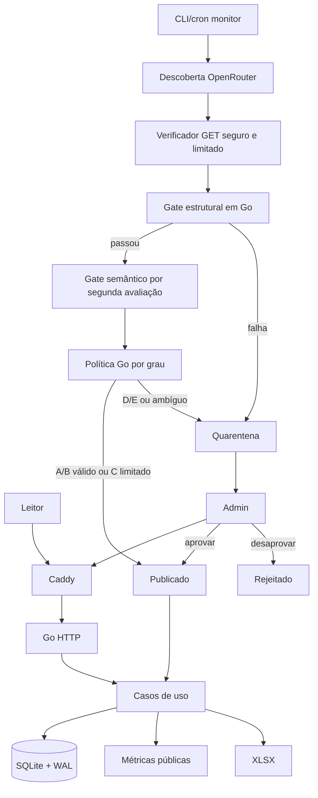

# Arquitetura

## Visão

Monólito modular Go, SSR, SQLite e Caddy. O mesmo código atende página pública, painel simples, importação, monitoramento e exportação.



## Módulos do MVP

```text
cmd/vorcarozap/
internal/{config,domain,store,editorial,moderation,research,monitoring,sourcecheck,metrics,importer,exporter,web}
migrations/ queries/ web/{components,pages,static}/
config/import-mapping-v1.yaml
```

Domínio não conhece chi, templ, SQLite, Excelize ou OpenRouter. `ResearchProvider` isola a API externa.

## Concorrência

O servidor atende leitura e raras mutações administrativas. `monitor` é chamado por cron/scheduler com lock persistente e idempotency key. Chamadas externas não mantêm transações abertas. WAL e `busy_timeout` absorvem a rara concorrência entre moderação e monitor.

`monitoring_runs` usa ciclo operacional próprio (`pending`, `running`, `partial`, `completed`, `failed`), separado dos estados editoriais. Descoberta e avaliação semântica podem usar modelos distintos por configuração.

## Métricas

Consultas SQL de rede agregam somente claims `published` e `metric_eligible = true`. Claims públicos de contexto/correção permanecem consultáveis sem inflar vínculos. Para a escala inicial, cálculo direto/cache em memória é suficiente. Publicação, rejeição, restauração e mudança de disposição/eligibilidade invalidam o cache. Snapshot histórico fica P1.

## Admin

SSR protegido por HTTP Basic Authentication e hash bcrypt (`ADMIN_USER`, `ADMIN_PASSWORD_HASH`, [ADR-016](adr/ADR-016-protecao-simples-do-admin-por-basic-auth-e-bcrypt.md)). Comportamento fail-closed (desabilitado responde 404 sem desafio) e ações editoriais protegidas contra CSRF via validação estrita de `Origin` com `ADMIN_ALLOWED_ORIGIN` ([ADR-017](adr/ADR-017-moderacao-humana-de-claims-transacoes-e-protecao-csrf.md)).
Ações de moderação humana em claims (`approve`, `reject`, `restore`) executam em transação SQLite atômica, validam suportes ativos, aplicam o padrão PRG (303 See Other) e registram auditoria imutável na tabela `moderation_decisions` com autor derivado exclusivamente do contexto HTTP autenticado. Uma source não é rejeitada globalmente. Não é CMS completo.

## Verificação de fonte

`sourcecheck` é um adaptador estreito de acessibilidade, não crawler. Ele faz GET com timeout, limite de bytes e redirects controlados, encerra a leitura ao atingir o limite e não persiste o corpo. Valida esquema, host e IP a cada redirect e bloqueia destinos locais, privados, link-local e de metadata. HEAD não é usado, porque muitos veículos o bloqueiam mesmo quando GET funciona.

## Evolução

FTS5, fila, múltiplos usuários, auditoria avançada e PostgreSQL dependem de medição/gatilhos.
