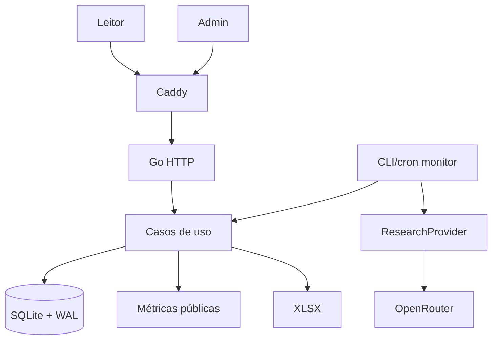

# Arquitetura

## Visão

Monólito modular Go, SSR, SQLite e Caddy. O mesmo código atende página pública, painel simples, importação, monitoramento e exportação.



## Módulos do MVP

```text
cmd/vorcarozap/
internal/{config,domain,store,editorial,research,monitoring,metrics,importer,exporter,web,admin}
migrations/ queries/ web/{components,pages,static}/
```

Domínio não conhece chi, templ, SQLite, Excelize ou OpenRouter. `ResearchProvider` isola a API externa.

## Concorrência

O servidor atende leitura e raras mutações administrativas. `monitor` é chamado por cron/scheduler com lock persistente e idempotency key. Chamadas externas não mantêm transações abertas. WAL e `busy_timeout` absorvem a rara concorrência entre moderação e monitor.

## Métricas

Consultas SQL agregam somente registros `published`. Para a escala inicial, cálculo direto/cache em memória é suficiente. Publicação, rejeição e restauração invalidam o cache. Snapshot histórico fica P1.

## Admin

SSR/HTMX, uma credencial administrativa e ações pequenas: listar, detalhar, rejeitar, restaurar/aprovar quarentena e disparar monitor. Não é CMS completo.

## Evolução

FTS5, fila, múltiplos usuários, auditoria avançada e PostgreSQL dependem de medição/gatilhos.

