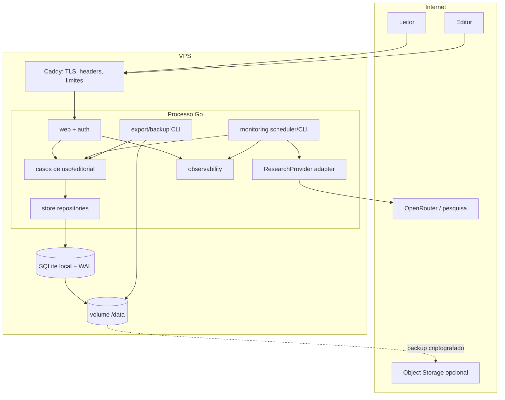

# Arquitetura

## Visão

Monólito modular, uma implantação e um banco, com fronteiras internas explícitas. A aplicação pública e o painel usam HTML server-side; HTMX melhora interações sem tornar JavaScript requisito para leitura. Comandos operacionais reutilizam os mesmos casos de uso.



## Dependências e módulos

`domain` contém tipos, invariantes, classificação e transições sem infraestrutura. `editorial` orquestra revisão/publicação. `store` implementa repositórios via `database/sql`/sqlc. `research` define `ResearchProvider` e adaptador OpenRouter. `monitoring` executa pipeline e leases. `export` gera XLSX/backup. `web` traduz HTTP/templ/HTMX. `auth` cuida de identidade, sessão e autorização. `observability` padroniza logs/métricas. `config` valida ambiente no startup.

Regra de dependência: adaptadores → casos de uso → domínio; domínio não conhece chi, templ, SQLite, excelize ou OpenRouter. Interfaces ficam no pacote consumidor e devem ser pequenas.

```text
cmd/vorcarozap/main.go
internal/{config,domain,store,editorial,research,monitoring,export,web,auth,observability}
migrations/  queries/  web/{components,pages,static}/
scripts/  tests/  docs/
Dockerfile  compose.yaml  Caddyfile  .env.example  Makefile
```

## Processos e concorrência

`serve` atende HTTP e, se habilitado, agenda apenas um monitor no processo. Para reduzir ambiguidade operacional, produção deve executar monitor por comando agendado ou scheduler embutido, nunca ambos. Lease persistente com chave única, owner, início e expiração impede paralelismo; renovação e retomada são explícitas. SQLite abre pool conservador de escritores e pool de leitura conforme medição.

Comandos: `serve`, `migrate`, `seed` (somente dados fictícios/configuração), `import`, `monitor`, `export`, `backup`. Cada comando possui exit codes, logs estruturados, dry-run quando aplicável e não migra implicitamente em produção.

## Decisões operacionais

- HTML completo para navegação; fragments HTMX reutilizam os mesmos view models.
- URLs públicas estáveis por slug mais ID interno; redirects para slugs anteriores.
- Busca MVP com índices SQLite e texto normalizado; avaliar FTS5 após medir e testar disponibilidade.
- Cache HTTP/ETag em páginas públicas e export; invalidação após publicação.
- Backup padrão pela Online Backup API para arquivo temporário, `integrity_check`, compressão/criptografia e rename/upload. `VACUUM INTO` é alternativa operacional, não cópia crua do arquivo vivo.
- Deploy de uma instância; migrations antes do tráfego e rollback por imagem + estratégia compatível de dados.

## Versões e dependências

A versão estável do Go e versões de chi, templ, sqlc, goose e excelize serão verificadas e fixadas no início da Fase 1, não inventadas nesta fase. Cada inclusão deve resolver requisito concreto, ter licença/reputação avaliadas e atualização planejada.

## Gatilhos de evolução

PostgreSQL quando houver réplicas, escritores/workers remotos, contenção relevante, analytics pesado, HA ou escala incompatível. Fila externa apenas quando lease/tabela de jobs e processo único não suportarem volume/isolamento. Separação de serviço apenas com necessidade operacional mensurada e fronteira já estável.

