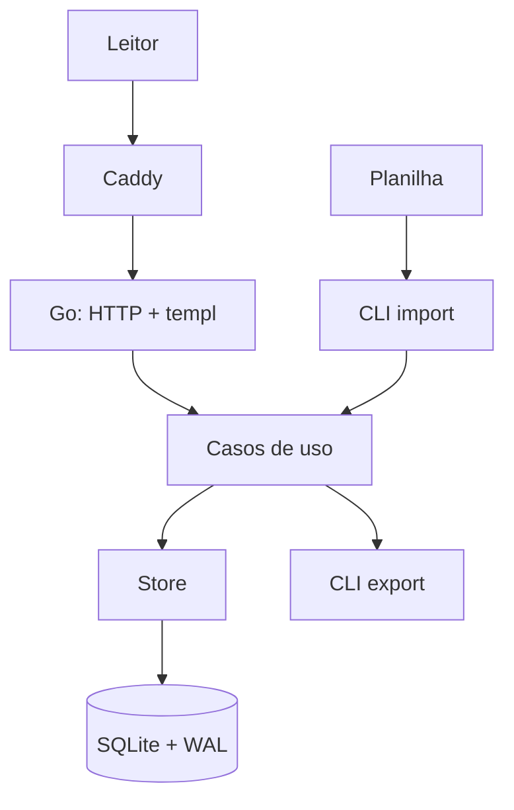

# Arquitetura

## Primeiro corte

Monólito Go server-side, SQLite local e Caddy. A primeira versão possui apenas leitura pública e comandos locais de importação/exportação.



## Pacotes iniciais

```text
cmd/vorcarozap/
internal/config/
internal/domain/
internal/store/
internal/importer/
internal/exporter/
internal/web/
migrations/
queries/
web/{components,pages,static}/
```

`research`, `monitoring`, `auth` e observabilidade avançada só serão criados quando suas fases começarem. Não criar pacotes vazios para uma arquitetura imaginária.

Regra de dependência: adaptadores dependem dos casos de uso; domínio não importa HTTP, SQLite, Excelize ou OpenRouter.

## Decisões do MVP

- SSR com `templ`; HTMX somente para melhorar filtros/navegação, mantendo links funcionais.
- Busca por índices e texto normalizado; FTS5 apenas se a medição exigir.
- SQLite em volume local e uma instância.
- Importação explícita, preferencialmente com `--dry-run`.
- Atualização de conteúdo por novo arquivo/importação; nenhuma escrita pública.
- Exportação executada por CLI e servida como arquivo pronto.
- Caddy termina TLS e encaminha para o binário Go.

## Evolução prevista

Painel/auth, monitor/OpenRouter, fila interna, snapshots, auditoria avançada, métricas e backup externo permanecem desenhados nos documentos específicos. Serão implementados por gatilho de produto, não por antecipação.

PostgreSQL somente com múltiplas instâncias/escritores, contenção relevante ou necessidade de HA.

