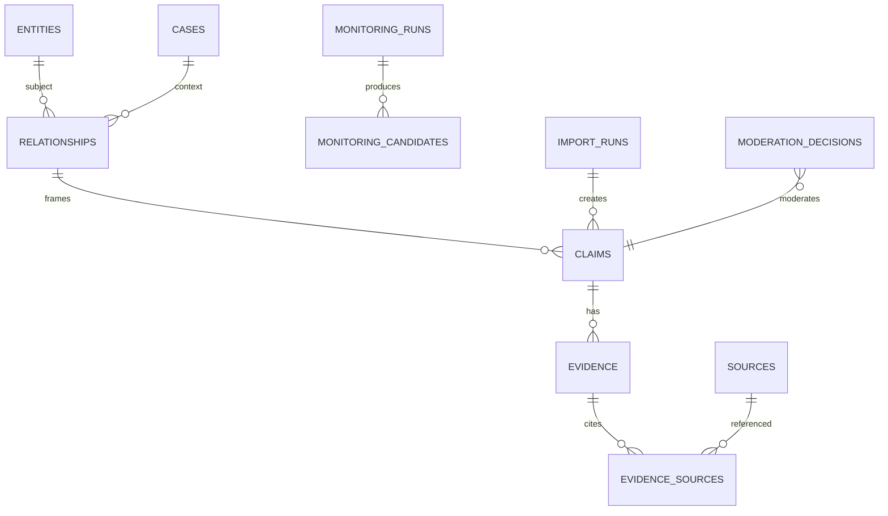

# Modelo de dados

## Núcleo do MVP

- `entities`: identidade, tipo, nome, slug, cargo, resumo, relevância e justificativa.
- `entity_aliases`: aliases normalizados.
- `cases`: recorte editorial.
- `relationships`: sujeito, alvo/caso, tipo, síntese e limites.
- `claims`: relação/caso, proposição, atribuição, `origin`, grau A–E, estado e datas.
- `evidence`: claim, resumo e tipo.
- `sources`: título, veículo/autor, URLs, publicação/acesso, tipo e disponibilidade.
- `evidence_sources`: evidence, source, trecho, localizador e papel; ID próprio permite múltiplos trechos.
- `monitoring_runs`: janela, providers/modelos de descoberta e avaliação, estado operacional, tokens/custo, erro e timestamps.
- `monitoring_candidates`: monitoring run, fingerprint global, payload normalizado, entidade encontrada, confiança técnica, resultados dos gates e estado editorial.
- `moderation_decisions`: alvo, decisão, motivo, fingerprint, ator único e data.
- `import_runs`: arquivo/hash, `origin = curated_seed`, versão do mapeamento, status e relatório.
- `exports`: arquivo, geração e hash opcional.

`evidence_grade` existe somente em `claims`. Grau de relação é derivado. `technical_confidence` existe somente no candidato/run.

O resultado do gate semântico é armazenado de forma auditável com os campos `identity_match`, `claim_supported`, `claim_overstates_source`, `attribution_explicit`, `grade_compatible`, `contains_illicit_inference`, `uncertainties` e `recommended_action`, além de modelo/schema/timestamp. A decisão final e os motivos pertencem à política Go.

## Estados

Claims/evidências/fontes possuem estado coerente com `quarantined`, `published`, `rejected` ou `archived`. A visibilidade pública é uma consulta explícita, não apenas um campo isolado: claim, evidência e fonte aplicáveis precisam estar publicados.

`monitoring_runs` não usa estados editoriais. Seu `status` aceita `pending`, `running`, `partial`, `completed` ou `failed`.

## Constraints e índices

- foreign keys e `CHECKs` para enums/faixas;
- nomes/aliases normalizados indexados;
- índices por estado, grau, relevância, atualização e fingerprint;
- XOR em relacionamentos com alvo entidade ou caso;
- URL/fingerprint sugerem duplicidade, mas pessoas nunca são mescladas automaticamente;
- decisões rejeitadas preservam fingerprint para bloquear republicação automática;
- `claims.origin` diferencia ao menos `openrouter`, `curated_seed` e `admin`;
- `monitoring_candidates.monitoring_run_id` é obrigatório; a importação curada cria claims diretamente e não simula um monitoring run;
- `import_runs.mapping_version` é obrigatório em importações aplicadas e referencia configuração versionada;
- decisões automáticas registram aprovação/reprovação de cada gate e a regra da matriz A–E aplicada.

## Métricas

Views/queries agregam apenas a visão pública. `public_metric_snapshots` fica opcional para histórico P1; o MVP calcula o estado corrente.

## Importação inicial

O mapeamento legado para o modelo A–E não fica codificado em condicionais do importador. Um arquivo como `config/import-mapping-v1.yaml` enumera rótulos reconhecidos, transformação e comportamento quando não houver equivalência segura. Cada execução persiste `mapping_version`; rótulo ausente ou não mapeável leva a quarentena.

## Defesa e contestação

No MVP, defesa/contestação reutiliza `evidence_sources.role = contradicts`. A consulta pública agrupa esses vínculos em seção própria. `defense_statements` continua P1.

## Futuro

`users`, `sessions`, `publication_revisions`, `editorial_summaries`, `source_snapshots`, `source_relationships`, auditoria completa e contraditório estruturado entram quando painel/equipe amadurecerem.
