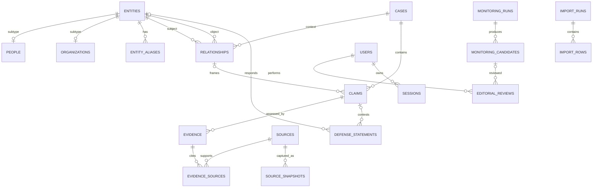

# Modelo de dados

## Convenções

SQLite `STRICT` quando compatível; IDs internos `INTEGER PRIMARY KEY`, IDs públicos aleatórios em `TEXT UNIQUE` (UUIDv7/ULID a decidir na Fase 1), datas instantes ISO-8601 UTC (`TEXT`) e datas civis `YYYY-MM-DD`. Booleanos são `INTEGER CHECK (IN (0,1))`. Todos os registros mutáveis têm `created_at`, `updated_at` e, quando publicados, `version` para concorrência otimista. Enums usam `CHECK` e migrations explícitas.

`entities` contém identidade comum; `people` e `organizations` são extensões 1:1. A separação evita colunas nulas e mantém relações polimórficas seguras. Alegações são independentes das pessoas.

## Entidades e campos principais

- **entities:** `id`, `public_id`, `kind(person|organization)`, `canonical_name`, `normalized_name`, `slug`, `editorial_status`, timestamps; `UNIQUE(kind, normalized_name)` não é imposto porque homônimos existem; `UNIQUE(slug)`.
- **people:** `entity_id PK/FK`, `public_name`, `role_title`, `short_bio`, `relevance 1..5`, `relevance_reason`, `first_identified_at`, `last_reviewed_at`.
- **organizations:** `entity_id PK/FK`, `organization_type`, `jurisdiction`, `website_url`.
- **entity_aliases:** `id`, `entity_id`, `alias`, `normalized_alias`, `alias_type`, `source_id nullable`; unique por entidade/normalização.
- **cases:** `id`, `public_id`, `name`, `slug UNIQUE`, `summary`, `status`, datas.
- **relationships:** `id`, `subject_entity_id`, `object_entity_id nullable`, `case_id nullable`, `relationship_type`, `summary`, `evidence_grade A..E nullable`, `editorial_status`, `valid_from/to`; exatamente um alvo (entidade ou caso), sem autorrelação.
- **claims:** `id`, `public_id`, `relationship_id nullable`, `case_id`, `statement`, `attribution`, `evidence_grade A..E`, `technical_confidence 0..100 nullable`, `editorial_status`, `first_identified_at`, `last_reviewed_at`, `published_at`, `version`.
- **evidence:** `id`, `claim_id`, `evidence_type`, `summary`, `locator`, `assessment`, `supports_role(supports|contradicts|contextualizes)`, `status`.
- **sources:** `id`, `public_id`, `source_type`, `title`, `publisher`, `author`, `original_url`, `canonical_url`, `archived_url`, `published_at`, `accessed_at`, `availability`, `integrity_hash`, `notes`; canonical URL index, sem presumir unicidade absoluta.
- **evidence_sources:** `evidence_id`, `source_id`, `excerpt`, `locator`, `origin_field`, PK composta. É a ligação que diz o que a fonte sustenta.
- **source_snapshots:** `id`, `source_id`, `captured_at`, `storage_key`, `mime_type`, `byte_size`, `sha256`, `access_class`, `redaction_status`; bytes podem ficar fora do DB.
- **defense_statements:** `id`, `entity_id nullable`, `claim_id nullable`, `statement`, `source_id`, `statement_at`, `request_status`, `requested_at`, `received_at`, `editorial_status`; exige entity ou claim.
- **monitoring_runs:** `id`, `public_id`, `idempotency_key UNIQUE`, `status`, janela, provider/model/schema versions, tokens/custo, checkpoints, erro redigido, timestamps.
- **monitoring_candidates:** `id`, `run_id`, `fingerprint`, `candidate_type`, `raw_payload_ref`, `normalized_json`, `matched_entity_id`, `confidence`, `status`, timestamps; `UNIQUE(run_id,fingerprint)` e fingerprint global indexado.
- **editorial_reviews:** `id`, `candidate_id nullable`, `claim_id nullable`, `reviewer_user_id`, `decision`, `reason`, `from_status`, `to_status`, `created_at`; alvo obrigatório.
- **change_log:** `id`, `aggregate_type/id`, `action`, `actor_type/id`, `before_json`, `after_json`, `reason`, `request_id`, `created_at`; append-only no aplicativo.
- **exports:** `id`, `public_id`, `format`, `status`, `database_version`, `storage_key`, `sha256`, `byte_size`, `generated_by`, timestamps.
- **users:** `id`, `email_normalized UNIQUE`, `display_name`, `password_hash` ou identidade externa, `role`, `active`, `mfa_state`, timestamps.
- **sessions:** `id_hash PK`, `user_id`, `csrf_secret_hash`, `created_at`, `expires_at`, `last_seen_at`, `revoked_at`, IP/user-agent minimizados.
- **slug_history:** `entity_id`, `slug UNIQUE`, `valid_until nullable` para redirects e prevenção de reutilização.
- **import_runs/import_rows:** arquivo/hash, mapeamento, dry-run/status e por linha `sheet`, número, conteúdo bruto, normalizado, erros, decisão e candidato resultante.

## Diagrama ER

## Constraints, índices e exclusão

Índices: nomes/aliases normalizados; status + atualização; claims por caso/status/grau; relationships por subject/object/case; evidências por claim; fontes por canonical URL/hash; candidatos por fingerprint/status; log por agregado/data; sessões por usuário/expiração. Índices compostos serão confirmados por planos de consulta.

`ON DELETE RESTRICT` para conteúdo publicado, fontes citadas, reviews e logs; `CASCADE` somente em filhos técnicos não publicados (sessões, linhas de import abandonada) e sempre por caso de uso auditado. Exclusão editorial é `archived`; pedido de eliminação/anomização é fluxo excepcional documentado, preservando o mínimo legal e integridade do log.

## Slugs e deduplicação

Slug: nome Unicode normalizado, transliterado, minúsculo, hífens e sufixo estável em colisão; mudança de nome cria redirect. Deduplicação combina nome/alias normalizado, organização/cargo, URLs, identificadores documentais e similaridade; nunca faz merge automático de pessoas. Fingerprint de alegação usa proposição normalizada + entidades + caso + fonte/localizador, mas colisão apenas sugere revisão.

## Importação da referência

1. Calcular SHA-256 e registrar arquivo, sem alterá-lo.
2. Detectar ZIP/XLSX seguro, limites e planilhas; rejeitar macros/links inesperados conforme política.
3. Apresentar mapeamento de cabeçalhos; não presumir layout futuro.
4. Guardar cada célula original e linha; normalizar em campos paralelos.
5. Validar URLs, datas, enums e relevância; emitir erro/aviso por linha.
6. Sugerir entidades/claims/fontes e duplicidades. A classificação legada fica em `raw`/metadados, sem conversão automática A–E.
7. Dry-run produz relatório sem writes editoriais. Aplicação usa transação e idempotency key do hash+mapeamento.
8. Criar candidatos `pending_review`; falha cancela a transação. Publicação é etapa humana separada.

