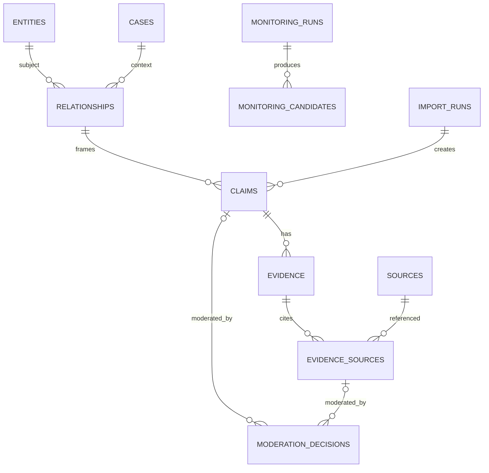

# Modelo de dados

## Núcleo do MVP

- `entities`: identidade, tipo, nome, slug, cargo, resumo, relevância e justificativa.
- `entity_aliases`: aliases normalizados.
- `cases`: recorte editorial.
- `relationships`: sujeito, alvo/caso, tipo, síntese e limites.
- `claims`: relação/caso, proposição, atribuição, `origin`, grau A–E, `disposition`, `metric_eligible`, estado e datas.
- `evidence`: claim, resumo e tipo.
- `sources`: título, veículo/autor, URLs, publicação/acesso, tipo, `source_access_status` e dados da última verificação.
- `evidence_sources`: evidence, source, trecho, localizador, papel e estado; ID próprio permite múltiplos trechos e moderação do uso específico.
- `monitoring_runs`: janela, providers/modelos de descoberta e avaliação, estado operacional, tokens/custo, erro e timestamps.
- `monitoring_candidates`: monitoring run, fingerprint global, payload normalizado, entidade encontrada, confiança técnica, resultados dos gates e estado editorial.
- `moderation_decisions`: `claim_id` anulável, `evidence_source_id` anulável, ação, motivo, fingerprint, ator único e data; exatamente um alvo.
- `import_runs`: arquivo/hash, `origin = curated_seed`, versão do mapeamento, status e relatório.
- `exports`: arquivo, geração e hash opcional.

`evidence_grade` existe somente em `claims`. Grau de relação é derivado. `technical_confidence` existe somente no candidato/run.

O resultado do gate semântico é armazenado de forma auditável com os campos `identity_match`, `claim_supported`, `claim_overstates_source`, `attribution_explicit`, `grade_compatible`, `contains_illicit_inference`, `uncertainties` e `recommended_action`, além de modelo/schema/timestamp. A decisão final e os motivos pertencem à política Go.

## Estados

Claims possuem estado `quarantined`, `published`, `rejected` ou `archived`. `evidence_sources.status` aceita `active` ou `rejected`. `sources` não têm rejeição editorial global: representam o documento e registram apenas disponibilidade/acessibilidade. A visibilidade pública é uma consulta explícita: claim publicado precisa de ao menos um `evidence_source` ativo com papel `supports`.

`monitoring_runs` não usa estados editoriais. Seu `status` aceita `pending`, `running`, `partial`, `completed` ou `failed`.

## Constraints e índices

- foreign keys e `CHECKs` para enums/faixas;
- `claims.disposition` aceita `supports_link`, `possible_link`, `contradicts_link`, `context_only` ou `correction`; `metric_eligible` é booleano;
- nomes/aliases normalizados indexados;
- índices por estado, grau, relevância, atualização e fingerprint;
- XOR em relacionamentos com alvo entidade ou caso;
- URL/fingerprint sugerem duplicidade, mas pessoas nunca são mescladas automaticamente;
- decisões rejeitadas preservam fingerprint para bloquear republicação automática;
- `moderation_decisions` aplica `CHECK ((claim_id IS NOT NULL) <> (evidence_source_id IS NOT NULL))`;
- `moderation_decisions.action` aceita `approve`, `reject`, `restore` ou `archive` conforme o tipo/estado do alvo;
- rejeição do último `evidence_source` ativo com papel `supports` coloca o claim em quarentena na mesma transação;
- `claims.origin` diferencia ao menos `openrouter`, `curated_seed` e `admin`;
- `monitoring_candidates.monitoring_run_id` é obrigatório; a importação curada cria claims diretamente e não simula um monitoring run;
- `import_runs.mapping_version` é obrigatório em importações aplicadas e referencia configuração versionada;
- decisões automáticas registram aprovação/reprovação de cada gate e a regra da matriz A–E aplicada.

## Representação temporal (VZ-004)

- Todos os campos de timestamp utilizam strings formatadas em UTC no padrão ISO-8601 (`YYYY-MM-DDTHH:MM:SS.fZ`), compatível com RFC-3339Nano e com as funções de data do SQLite.
- Valores default em inserção são gerados no SQLite via `strftime('%Y-%m-%dT%H:%M:%fZ', 'now')`.
- Atualizações de `updated_at` são tratadas explicitamente nas queries/código da aplicação, sem recorrer a triggers desnecessárias.

## Decisão de modelagem: claims e relacionamentos (VZ-004)

- Todo `claim` referencia obrigatoriamente um `relationship_id` (`RELATIONSHIPS ||--o{ CLAIMS : frames`).
- A entidade `relationships` implementa a restrição XOR (`target_entity_id preenchido XOR case_id preenchido`) e bloqueio de autorrelação (`target_entity_id != subject_entity_id`), ancorando a alegação ao sujeito e ao seu contexto (outra entidade ou um caso de investigação).
- Isso elimina duplicidade e ambiguidade entre um eventual `case_id` direto no claim e o alvo definido na relação, preservando a hierarquia relacional e simplificando consultas de rede.
- Todas as chaves estrangeiras contêm cláusulas `ON DELETE` explícitas (`RESTRICT` por padrão para histórico e integridade referencial, `CASCADE` para aliases e `SET NULL` para import_runs).

## Métricas

Views/queries de rede agregam `claims.status = published AND claims.metric_eligible = true`. Contexto/correção público permanece na consulta e XLSX, mas não conta como contato/vínculo. `public_metric_snapshots` fica opcional para histórico P1; o MVP calcula o estado corrente.

## Importação inicial e hardening (VZ-005)

O mapeamento legado para o modelo A–E não fica codificado em condicionais do importador. `config/import-mapping-v1.yaml` enumera rótulos e define `grade`, `initial_state`, `disposition` e `metric_eligible`. Cada execução persiste `mapping_version`; rótulo ausente ou não mapeável leva a quarentena.

A migration `00003_import_foundation_hardening.sql` introduziu refinamentos estruturais para garantir fidelidade editorial e idempotência real:
- **Idempotência estrita:** índice único parcial `uq_import_runs_applied` em `import_runs(file_hash, mapping_version)` para execuções onde `is_dry_run = 0 AND status IN ('running', 'completed', 'partial')`. Isso impede concorrência e duplicidade a nível de banco, permitindo repetição de execuções `failed` e simulações com `--dry-run`.
- **Fontes sem metadados inventados:** a planilha inicial contém apenas URLs, sem fornecer título de artigo, autor ou veículo em colunas segregadas. O schema de `sources` foi ajustado para permitir `title` e `publisher_or_author` como strings vazias/desconhecidas para a origem `curated_seed`, com status `not_checked`, evitando invenções artificiais de metadados. A coluna `canonical_url` possui índice único para deduplicação determinística.
- **Resumo editorial não é citação literal:** a coluna "O que está documentado" é uma síntese editorial e alimenta exclusivamente `evidence.summary`. A tabela `evidence_sources` aceita `excerpt` vazio no seed legado, preservando a distinção pública futura entre resumo editorial da equipe e trecho literal extraído da fonte.

## Defesa e contestação

No MVP, defesa/contestação reutiliza `evidence_sources.role = contradicts`. A consulta pública agrupa esses vínculos em seção própria. `defense_statements` continua P1.

## Acessibilidade da fonte

`sources.source_access_status` aceita `cited_by_provider`, `reachable`, `unreachable` ou `not_checked`, acompanhado por `source_access_checked_at`, status HTTP final anulável e código de erro normalizado anulável. Citação do OpenRouter começa em `cited_by_provider`; source do `curated_seed` começa em `not_checked`. GET seguro pode promover ambas a `reachable`. Erro definitivo, como 404/410, vira `unreachable`; timeout, 429, 5xx ou bloqueio inconclusivo vira `not_checked`. `unreachable` põe o candidato/claim novo em quarentena; `not_checked` segue a política diferenciada por origem definida no [ADR-006](adr/ADR-006-fontes-e-rastreabilidade.md) (quarentena para OpenRouter; preserva initial_state para curated_seed).

## Futuro

`users`, `sessions`, `publication_revisions`, `editorial_summaries`, `source_snapshots`, `source_relationships`, auditoria completa e contraditório estruturado entram quando painel/equipe amadurecerem.
