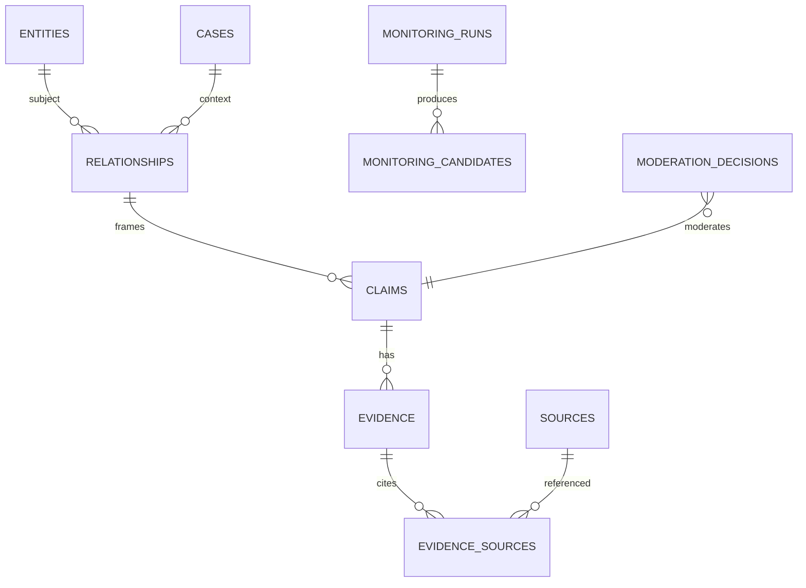

# Modelo de dados

## Núcleo do MVP

- `entities`: identidade, tipo, nome, slug, cargo, resumo, relevância e justificativa.
- `entity_aliases`: aliases normalizados.
- `cases`: recorte editorial.
- `relationships`: sujeito, alvo/caso, tipo, síntese e limites.
- `claims`: relação/caso, proposição, atribuição, grau A–E, estado e datas.
- `evidence`: claim, resumo, tipo e papel.
- `sources`: título, veículo/autor, URLs, publicação/acesso, tipo e disponibilidade.
- `evidence_sources`: evidence, source, trecho, localizador e papel; ID próprio permite múltiplos trechos.
- `monitoring_runs`: janela, provider/modelo, status, tokens/custo, erro e timestamps.
- `monitoring_candidates`: run, fingerprint global, payload normalizado, entidade encontrada, confiança técnica e estado.
- `moderation_decisions`: alvo, decisão, motivo, fingerprint, ator único e data.
- `import_runs`: arquivo/hash, mapeamento, status e relatório.
- `exports`: arquivo, geração e hash opcional.

`evidence_grade` existe somente em `claims`. Grau de relação é derivado. `technical_confidence` existe somente no candidato/run.

## Estados

Claims/evidências/fontes possuem estado coerente com `quarantined`, `published`, `rejected` ou `archived`. A visibilidade pública é uma consulta explícita, não apenas um campo isolado: claim, evidência e fonte aplicáveis precisam estar publicados.

## Constraints e índices

- foreign keys e `CHECKs` para enums/faixas;
- nomes/aliases normalizados indexados;
- índices por estado, grau, relevância, atualização e fingerprint;
- XOR em relacionamentos com alvo entidade ou caso;
- URL/fingerprint sugerem duplicidade, mas pessoas nunca são mescladas automaticamente;
- decisões rejeitadas preservam fingerprint para bloquear republicação automática.

## Métricas

Views/queries agregam apenas a visão pública. `public_metric_snapshots` fica opcional para histórico P1; o MVP calcula o estado corrente.

## Futuro

`users`, `sessions`, `publication_revisions`, `editorial_summaries`, `source_snapshots`, `source_relationships`, auditoria completa e contraditório estruturado entram quando painel/equipe amadurecerem.

