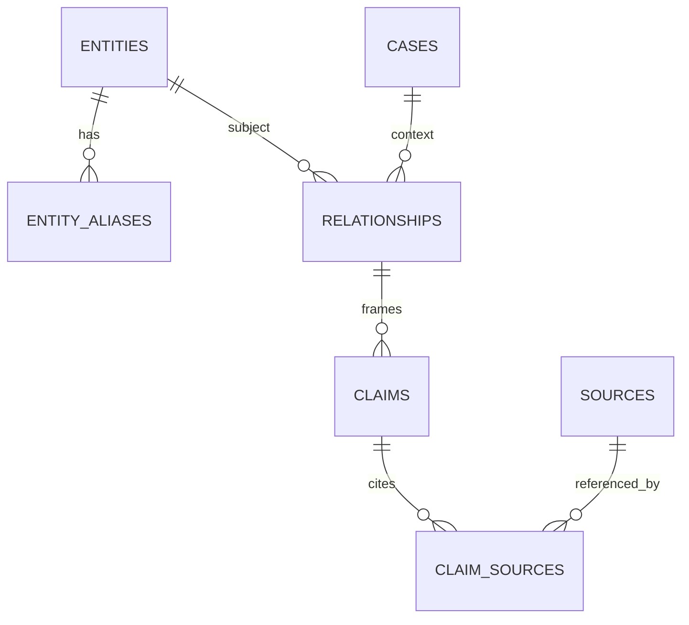

# Modelo de dados

## Estratégia incremental

O schema inicial implementa apenas o necessário para importar e publicar a base. Tabelas de autenticação, monitoramento, revisão multiusuário, snapshots e auditoria avançada serão adicionadas por migrations futuras.

## Schema mínimo do MVP

- **entities:** identidade comum, nome, nome normalizado, slug, tipo, resumo, cargo/função, relevância, justificativa e datas.
- **entity_aliases:** nomes alternativos utilizados na busca.
- **cases:** caso/recorte editorial e resumo.
- **relationships:** entidade relacionada ao caso ou a outra entidade, tipo, síntese e limites.
- **claims:** proposição atribuível ligada à relação/caso, grau A–E, atribuição, estado público e datas.
- **sources:** título, veículo/autor, URL, publicação, acesso, tipo e observação.
- **claim_sources:** ligação entre alegação e fonte, papel, trecho/localizador e observação.
- **import_runs:** arquivo, hash, mapeamento, status, data e resumo de erros.
- **exports:** arquivo gerado, data, versão e hash quando aplicável.

O grau A–E pertence à alegação. A relação pode exibir um grau derivado das alegações publicadas, mas não mantém uma segunda classificação independente.

A confiança técnica pertence futuramente ao candidato/execução de monitoramento, não à alegação publicada.

## Convenções

- `INTEGER PRIMARY KEY` interno e slug público estável no MVP;
- datas em ISO-8601 UTC;
- booleanos com `CHECK`;
- enums pequenos com `CHECK`;
- foreign keys habilitadas;
- índices em nome normalizado, slug, status, grau, relevância e chaves estrangeiras;
- exclusão editorial por arquivamento quando o dado já esteve público.

`claim_sources` usa ID próprio, permitindo múltiplos trechos/localizadores da mesma fonte.

## Importação

1. calcular hash do arquivo;
2. validar formato e cabeçalhos;
3. executar dry-run e apresentar erros;
4. normalizar nomes sem apagar o valor original relevante;
5. evitar duplicação pelo hash e chaves naturais auxiliares;
6. importar em transação;
7. não fortalecer automaticamente a classificação original.

## Tabelas futuras

Quando painel e monitoramento forem implementados: `users`, `sessions`, `editorial_reviews`, `change_log`, `publication_revisions`, `editorial_summaries`, `monitoring_runs`, `monitoring_candidates`, `evidence`, `source_snapshots`, `source_relationships` e estruturas de contraditório.

