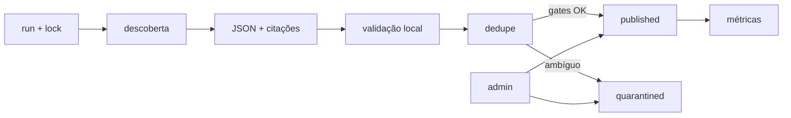

# Monitoramento, pesquisa e LLM

## Papel no MVP

O monitoramento via OpenRouter é parte central do produto. Ele encontra novas publicações, extrai dados estruturados, deduplica e alimenta automaticamente a base.

```go
type ResearchProvider interface {
    Discover(ctx context.Context, input DiscoverInput) (DiscoverResult, error)
    Verify(ctx context.Context, input VerifyInput) (VerifyResult, error)
}
```

## OpenRouter

Configurar modelo, base URL e engine por ambiente. Usar structured outputs com JSON Schema e a ferramenta vigente `openrouter:web_search`, revalidando documentação no início da implementação:

- [Web Search Server Tool](https://openrouter.ai/docs/guides/features/server-tools/web-search)
- [Structured Outputs](https://openrouter.ai/docs/guides/features/structured-outputs)
- [Quickstart](https://openrouter.ai/docs/quickstart)

## Pipeline



## Gates

Schema válido, URL/citação presente, entidade resolvida, alegação limitada, linguagem compatível com grau, dados pessoais minimizados, fingerprint não rejeitado e custo dentro do teto.

A validação pode usar uma segunda chamada mais forte apenas para candidatos relevantes/ambíguos. O modelo sugere classificação; regras locais decidem publicação/quarentena.

## Economia e resiliência

- busca incremental por janela;
- cache/fingerprint de URLs;
- modelo econômico para descoberta;
- verificação seletiva;
- limites por run/dia;
- timeout e retry somente transitório;
- lock e idempotência;
- registro de modelo, tokens e custo;
- execução parcial não remove dados já válidos.

Testes de contrato automatizados são P1; no MVP usar fixtures mínimas e smoke run com orçamento baixo.

