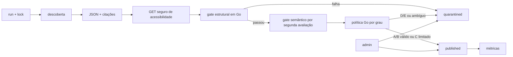

# Monitoramento, pesquisa e LLM

## Papel no MVP

O monitoramento via OpenRouter é parte central do produto. Ele encontra novas publicações, extrai dados estruturados, deduplica e alimenta automaticamente a base.

```go
type ResearchProvider interface {
    Discover(ctx context.Context, input DiscoverInput) (DiscoverResult, error)
    Verify(ctx context.Context, input VerifyInput) (VerifyResult, error)
}
```

## OpenRouter

Configurar modelo, base URL e engine por ambiente. Usar structured outputs com JSON Schema e a ferramenta vigente `openrouter:web_search`, revalidando documentação no início da implementação:

- [Web Search Server Tool](https://openrouter.ai/docs/guides/features/server-tools/web-search)
- [Structured Outputs](https://openrouter.ai/docs/guides/features/structured-outputs)
- [Quickstart](https://openrouter.ai/docs/quickstart)

## Pipeline



## Gate estrutural

Executado deterministicamente em Go: schema válido; URL `http/https`; título/publicador; trecho ou localizador; datas normalizadas; grau A–E; entidade vinculada; fingerprint não rejeitado; PII proibida ausente; limites de tamanho; deduplicação; acessibilidade conforme política; e custo dentro do orçamento.

## Gate semântico

Uma segunda chamada retorna, sob schema estrito:

```json
{
  "identity_match": true,
  "claim_supported": true,
  "claim_overstates_source": false,
  "attribution_explicit": true,
  "grade_compatible": true,
  "contains_illicit_inference": false,
  "uncertainties": [],
  "recommended_action": "publish"
}
```

A avaliação verifica identidade, suporte, extrapolação, atribuição, grau, inferência ilícita e ambiguidades. O modelo recomenda; a política Go decide.

## Política final

- A/B: publica quando os dois gates passam.
- C: publica quando os dois gates passam e há linguagem de associação e limites explícitos.
- D/E: quarentena por padrão; podem ser aprovados no painel.
- Qualquer grau: quarentena para homônimo, source `unreachable`, trecho sem suporte direto, acusação criminal não confirmada, PII desnecessária, divergência entre estágios ou rejeição semelhante. `not_checked` segue configuração conservadora por padrão.

Descoberta e gate semântico podem usar modelos diferentes por configuração. Os resultados, modelo, schema e motivos da política ficam registrados.

## Acessibilidade da fonte

A citação recebida começa como `cited_by_provider`; source do `curated_seed` começa como `not_checked`. Antes da decisão automática/inicial, o verificador tenta GET seguro e limitado: não usa HEAD, não persiste o corpo, para de ler no limite configurado, aplica timeout e segue somente redirects controlados, revalidando host/IP em cada salto. Resposta válida promove a `reachable`; 404/410 ou outro erro comprovadamente definitivo vira `unreachable`; timeout, 429, 5xx ou bloqueio inconclusivo vira `not_checked`. O verificador não extrai conteúdo e não é crawler.

## Economia e resiliência

- busca incremental por janela;
- cache/fingerprint de URLs;
- modelo econômico para descoberta;
- verificação seletiva;
- limites por run/dia;
- timeout e retry somente transitório;
- lock e idempotência;
- registro de modelo, tokens e custo;
- execução parcial não remove dados já válidos.

`monitoring_runs` usa estados operacionais `pending`, `running`, `partial`, `completed` e `failed`; eles não se confundem com os quatro estados editoriais.

Testes de contrato amplos são P1; no MVP há fixtures mínimas, smoke run com orçamento baixo e testes unitários table-driven da política de publicação, bloqueio por fingerprint e métricas públicas.
