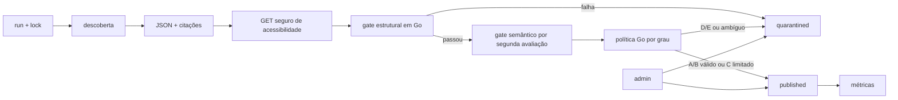

# Monitoramento, pesquisa e LLM

## Papel no MVP

O monitoramento via OpenRouter é parte central do produto. Ele encontra novas publicações, extrai dados estruturados, deduplica e alimenta automaticamente a base.

```go
type ResearchProvider interface {
    Discover(ctx context.Context, input DiscoverInput) (DiscoverResult, error)
    Verify(ctx context.Context, input VerifyInput) (VerifyResult, error)
}
```

## OpenRouter

Configurar modelo, base URL e engine por ambiente. Usar structured outputs com JSON Schema e a ferramenta vigente `openrouter:web_search`, revalidando documentação no início da implementação:

- [Web Search Server Tool](https://openrouter.ai/docs/guides/features/server-tools/web-search)
- [Structured Outputs](https://openrouter.ai/docs/guides/features/structured-outputs)
- [Quickstart](https://openrouter.ai/docs/quickstart)

## Pipeline



## Gate estrutural

Executado deterministicamente em Go: schema válido; URL `http/https`; título/publicador; trecho ou localizador; datas normalizadas; grau A–E; entidade vinculada; fingerprint não rejeitado; PII proibida ausente; limites de tamanho; deduplicação; acessibilidade conforme política; e custo dentro do orçamento.

## Gate semântico

Uma segunda chamada retorna, sob schema estrito:

```json
{
  "identity_match": true,
  "claim_supported": true,
  "claim_overstates_source": false,
  "attribution_explicit": true,
  "grade_compatible": true,
  "contains_illicit_inference": false,
  "uncertainties": [],
  "recommended_action": "publish"
}
```

A avaliação verifica identidade, suporte, extrapolação, atribuição, grau, inferência ilícita e ambiguidades. O modelo recomenda; a política Go decide.

## Política final

- A/B: publica quando os dois gates passam.
- C: publica quando os dois gates passam e há linguagem de associação e limites explícitos.
- D/E: quarentena por padrão; podem ser aprovados no painel.
- Qualquer grau: quarentena para homônimo, source `unreachable`, trecho sem suporte direto, acusação criminal não confirmada, PII desnecessária, divergência entre estágios ou rejeição semelhante; `not_checked` segue a política diferenciada por origem definida no [ADR-006](adr/ADR-006-fontes-e-rastreabilidade.md) (quarentena para OpenRouter; preserva initial_state do mapeamento para curated_seed).

Descoberta e gate semântico podem usar modelos diferentes por configuração (`OPENROUTER_DISCOVERY_MODEL` e `OPENROUTER_VERIFICATION_MODEL`, default `openai/gpt-4.1-mini`). Os resultados, modelo, schema e motivos da política ficam registrados na tabela imutável `semantic_evaluations` e nos campos de auditoria de `monitoring_candidates` ([ADR-014](adr/ADR-014-gate-estrutural-gate-semantico-e-politica-de-publicacao-automatica.md)).

## Acessibilidade da fonte

A citação recebida começa como `cited_by_provider`; source do `curated_seed` começa como `not_checked`. Antes da decisão automática/inicial, o verificador tenta GET seguro e limitado: não usa HEAD, não persiste o corpo, para de ler no limite configurado, aplica timeout e segue somente redirects controlados, revalidando host/IP em cada salto. Resposta válida promove a `reachable`; 404/410 ou outro erro comprovadamente definitivo vira `unreachable`; timeout, 429, 5xx ou bloqueio inconclusivo vira `not_checked`. `unreachable` sempre leva a quarentena; `not_checked` segue a política do [ADR-006](adr/ADR-006-fontes-e-rastreabilidade.md). O verificador não extrai conteúdo e não é crawler.

## Economia, controle de custos e resiliência (VZ-013)

A execução operacional implementa garantias rígidas de segurança contra concorrência, avanços temporais determinísticos e controle financeiro baseado no custo real cobrado ([ADR-015](adr/ADR-015-lock-de-execucao-janela-incremental-e-limites-de-custo-llm.md)):

### 1. Lock com Lease em SQLite (`monitoring_locks`)
- Aquisição atômica condicional via `INSERT ... ON CONFLICT DO UPDATE ... WHERE expires_at < now`;
- Renovação periódica em background por goroutine (`TTL / 3`), cancelando imediatamente o contexto de execução caso o lease seja perdido;
- Liberação condicional ao encerrar pelo titular legítimo (`holder`);
- TTL configurável (`MONITOR_LOCK_TTL`, padrão `10m`), permitindo recuperação automática após quedas abruptas de processo.

### 2. Janela Incremental Determinística
- `window_end` fixado no início da execução em UTC (`now.UTC()`);
- `window_start` obtido a partir do `window_end` da última execução concluída com sucesso (`status = 'completed'`) para a mesma consulta;
- Limite máximo de retroação delimitado por `MONITOR_WINDOW` (padrão `24h`, máximo `720h`);
- Execuções com falha (`failed`) ou parciais (`partial`) não avançam o watermark, garantindo que a rodada seguinte cubra o período pendente.

### 3. Gestão de Custo Real e Limites Orçamentários
- O OpenRouter retorna o custo real cobrado no campo `usage.cost` de cada resposta da API, utilizado como fonte mandatória de verdade financeira com validação defensiva estrita (*fail-closed* via aritmética racional exata `math/big.Rat` e arredondamento *ceiling* para micro-USD inteiros);
- Toda a contabilidade, persistência e comparações orçamentárias utilizam números inteiros em microdólares (`int64`, `cost_microusd INTEGER`), enquanto colunas `REAL` legadas são calculadas no SQL a partir do inteiro (`cost_microusd / 1000000.0`), eliminando qualquer imprecisão de float;
- **Pré-checagem diária UTC:** consulta a soma inteira `total_cost_microusd` de todas as runs do dia UTC corrente desde `00:00:00Z`. Se o orçamento diário (`MONITOR_MAX_COST_PER_DAY_USD`) estiver esgotado, aborta antes de gerar custos de descoberta;
- **Limite determinístico de candidatos:** `MONITOR_MAX_CANDIDATES_PER_RUN` restringe a quantidade de candidatos avaliados. Excedentes permanecem auditáveis em `quarantined` e a run finaliza como `partial`;
- **Persistência imediata de descoberta e preservação em falhas:** tokens e custos da chamada de descoberta são gravados em `monitoring_runs` imediatamente com contexto independente, e 100% preservados em caso de falha posterior ou perda de lease;
- **Verificação atômica e parada segura (`partial`):** a cada candidato avaliado no gate semântico, `semantic_evaluations`, status do candidato, materialização editorial e agregação do ledger da run ocorrem na mesma transação atômica. Se o teto por execução (`MONITOR_MAX_COST_PER_RUN_USD`), o teto diário ou o limite de verificações (`MONITOR_MAX_VERIFICATIONS_PER_RUN`) for atingido, a esteira encerra graciosamente marcando o status operacional como `partial`, mantendo os candidatos restantes em quarentena.

### 4. Execução via CLI
O subcomando de monitoramento permite disparos manuais e automação via cron:
```bash
./bin/vorcarozap monitor --query "Daniel Vorcaro Banco Master"
```
Ao término, um sumário operacional detalha status, janela UTC, candidatos descobertos/únicos/duplicados, publicações, quarentenas, tokens e custos reais consolidados.

`monitoring_runs` usa estados operacionais `pending`, `running`, `partial`, `completed` e `failed`; eles não se confundem com os estados editoriais dos candidatos (`quarantined`, `published`, `rejected`).

Testes de contrato amplos são P1; no MVP há fixtures mínimas, smoke run com orçamento baixo e testes unitários table-driven da política de publicação, bloqueio por fingerprint, lock lease, janela incremental, limites de orçamento e métricas públicas.
