# Monitoramento, pesquisa e LLM

## Contrato e isolamento

```go
type ResearchProvider interface {
    Discover(ctx context.Context, input DiscoverInput) (DiscoverResult, error)
    Verify(ctx context.Context, input VerifyInput) (VerifyResult, error)
}
```

Inputs incluem janela, consulta, fontes já conhecidas, limites e versão de schema; resultados incluem itens tipados, citações, proveniência por campo, uso/custo e referência ao bruto. O domínio recebe tipos validados e não conhece payload/API. `OpenRouterProvider` será o primeiro adaptador; modelos, base URL e engine são configuração, nunca constantes de negócio.

## Estado da API consultado em 03/09/2026

Segundo a documentação oficial, o endpoint compatível é `/api/v1/chat/completions`; autenticação usa Bearer API key. Structured outputs usam `response_format` com `type: json_schema`, `strict: true` e `additionalProperties: false`, mas apenas em modelos compatíveis; selecionar modelos pelos parâmetros suportados e exigir suporte no roteamento.

Para web search, o plugin `plugins:[{id:"web"}]` e o sufixo `:online` estão depreciados. A opção vigente é a server tool beta `tools:[{type:"openrouter:web_search"}]`, que pode pesquisar 0–N vezes; engine `auto` usa busca nativa quando possível e fallback. Por estar beta, o adaptador deve versionar payload, ter teste de contrato e permitir desligamento/troca. Fontes: [server tool](https://openrouter.ai/docs/guides/features/server-tools/web-search), [structured outputs](https://openrouter.ai/docs/guides/features/structured-outputs), [quickstart](https://openrouter.ai/docs/quickstart).

Configuração:

```env
OPENROUTER_API_KEY=
OPENROUTER_BASE_URL=https://openrouter.ai/api/v1
OPENROUTER_MODEL_DISCOVERY=
OPENROUTER_MODEL_VERIFICATION=
OPENROUTER_MODEL_SUMMARY=
OPENROUTER_SEARCH_ENGINE=auto
```

No startup/monitor, validar que modelos existem e suportam structured outputs/tool relevante; falhar com diagnóstico seguro. Não usar aliases móveis em produção sem política consciente de mudança. Registrar ID solicitado e efetivamente usado, provider, schema/prompt versions.

## Pipeline reiniciável

```mermaid
flowchart LR
  A[run + lease] --> B[descoberta por janela]
  B --> C[JSON estrito + validação local]
  C --> D[normalização/deduplicação]
  D --> E[candidatos]
  E --> F[verificação direcionada]
  F --> G[primária/2ª confirmação]
  G --> H[contraditório]
  H --> I[confiança técnica]
  I --> J[pending_review]
  J -->|humano| K[approved]
  K -->|editor| L[published]
  L --> M[histórico + resumo + XLSX]
```



Cada etapa grava checkpoint e artefato imutável antes da próxima. Idempotency key combina tipo, janela, versão da consulta/schema e configuração relevante. URLs canônicas, hash do conteúdo e fingerprints evitam repetição; rejeições participam da comparação. Retomar não repete efeitos concluídos. Lease única tem owner/heartbeat/expiry e takeover auditado.

Falha de uma fonte/candidato não aborta outros; o run termina `partial` e pode retomar. Transações são curtas e não abrangem chamadas externas. Respostas brutas ficam em armazenamento restrito por referência/hash, com retenção a validar.

## Schemas, confiança e proveniência

JSON Schema proíbe campos extras, limita strings/listas, exige `source_url`, `source_title`, trecho/localizador, data quando conhecida, tipo, entidade textual e linguagem de incerteza. Validação local rejeita URL insegura, enum desconhecido e citação inexistente. Nenhum texto do modelo é confiado como HTML.

Confiança técnica é explicável: identidade, qualidade/corroboração da fonte, consistência temporal, precisão do localizador e deduplicação, com penalidade por ambiguidade. Pesos serão versionados/testados; o valor apenas prioriza fila e nunca define grau ou publicação.

Cada campo extraído referencia run, resposta, consulta, URL, trecho/localizador e método (`model`, `deterministic`, `human`). Edição humana preserva valor anterior e justificativa.

## Custo, privacidade e resiliência

Limites por run/dia/mês: buscas, resultados, candidatos, tokens, custo e tamanho. Descoberta barata precede verificação seletiva; cache por consulta/janela e early stop evitam gasto. Circuit breaker e budget hard-stop deixam candidatos incompletos, não publicam. Métricas usam tokens/custos retornados e estimativa reconciliada.

Timeouts separados para conexão/resposta/run; retry com backoff/jitter somente em 429/5xx/timeouts seguros e respeitando `Retry-After`. 4xx de schema/auth não repetem. Chave nunca aparece em log. Avaliar política de dados/logging e Zero Data Retention dos providers/modelos escolhidos antes de enviar conteúdo sensível.

## Testes e revisão da decisão

Fixtures totalmente fictícias: sucesso, recusa, JSON inválido, citação ausente, prompt injection, timeout, 429, custo excedido e mudança de modelo. Contrato em ambiente controlado confirma server tool + schema (inclusive combinação entre ambos) antes de ativar produção. Revisar ADR quando server tool sair do beta/mudar, structured outputs variar, custos/privacy forem inadequados ou outro provedor superar requisitos.

